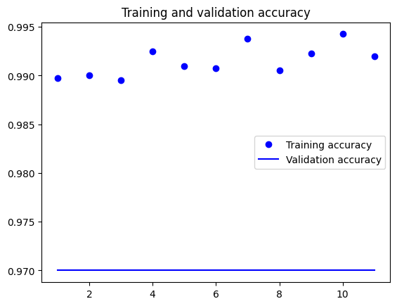
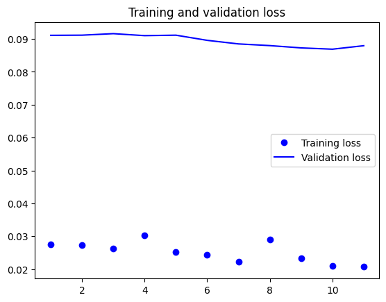
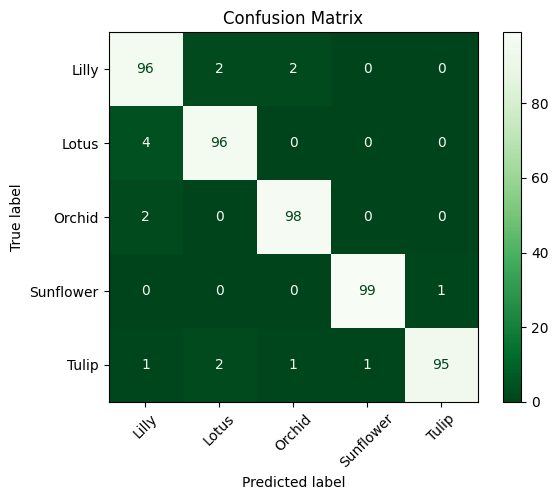

# Flower Image Classification: Classical ML vs. Deep Learning

A comparative computer-vision project evaluating **classical machine learning** and **transfer-learning CNNs** for flower image classification. The project compares Random Forest, Multi-Layer Perceptron (MLP), and Support Vector Machine (SVM) models with VGG16, Xception, and EfficientNetB0.

## Highlights

- Analyzed two balanced flower-image datasets with **5,000 images / 5 classes** and **11,200 images / 7 classes**.
- Reduced **97,200 raw pixel features to 699 principal components** while retaining approximately **95% of variance** for classical ML.
- Trained and tuned Random Forest, MLP, and SVM models with cross-validation and grid search; also evaluated voting and stacking ensembles.
- Applied transfer learning and selective fine-tuning with **VGG16, Xception, and EfficientNetB0** using TensorFlow/Keras.
- Achieved the strongest reported test accuracy of **96.8%** with fine-tuned EfficientNetB0 on the small dataset.

## Methods

### Classical machine learning

Images were resized to 180 × 180 pixels and flattened for the classical models. PCA was used for dimensionality reduction before training Random Forest, MLP, and SVM classifiers. Model development included cross-validation, grid-search hyperparameter tuning, hard/soft voting, and stacking.

### Deep learning

Pretrained VGG16, Xception, and EfficientNetB0 networks were evaluated using transfer learning. Experiments included frozen feature extraction followed by selective fine-tuning, with early stopping and model checkpointing. Performance was evaluated with test accuracy, training/validation curves, and confusion matrices.

## Results

### Classical models — small dataset

| Model | Baseline accuracy | Tuned accuracy |
|---|---:|---:|
| Random Forest | 78.5% | **81.5%** |
| MLP | 77.8% | 79.1% |
| SVM | 76.6% | 79.6% |

Hard voting achieved **80.4%** test accuracy; stacking did not outperform the strongest individual classifier.

### Transfer-learning CNNs

| Model | Small baseline | Small fine-tuned | Large baseline | Large fine-tuned |
|---|---:|---:|---:|---:|
| VGG16 | 85.4% | 92.8% | 87.6% | 92.4% |
| Xception | 90.2% | 94.0% | 87.2% | 94.0% |
| EfficientNetB0 | 96.4% | **96.8%** | 94.2% | 94.9% |

The strongest result was **96.8% test accuracy** from fine-tuned EfficientNetB0 on the 5-class dataset.

## Example results

### Fine-tuned EfficientNetB0 training curves





### Fine-tuned EfficientNetB0 confusion matrix



## Repository structure

```text
flower-image-classification/
├── README.md
├── requirements.txt
├── .gitignore
├── LICENSE
├── notebooks/
│   └── flower_image_classification.ipynb
└── results/
    └── figures/
        ├── efficientnet_finetuned_accuracy.png
        ├── efficientnet_finetuned_loss.png
        ├── efficientnet_confusion_matrix.png
        └── efficientnet_confusion_matrix_normalized.png
```

## Datasets

The notebook downloads the datasets with `kagglehub`:

- Small dataset: `kausthubkannan/5-flower-types-classification-dataset`
- Large dataset: `nadyana/flowers`

The datasets are not committed to this repository. Review the original dataset pages and their terms before reuse.

## Getting started

```bash
git clone <your-repository-url>
cd flower-image-classification
python -m venv .venv
source .venv/bin/activate   # macOS/Linux
pip install -r requirements.txt
jupyter notebook notebooks/flower_image_classification.ipynb
```

The project was developed in a notebook/Google Colab workflow. GPU acceleration is recommended for CNN training and fine-tuning.

## Interactive demo

The notebook includes a **Gradio** interface for classifying an uploaded flower image with the fine-tuned small-dataset EfficientNetB0 model. Trained `.keras` checkpoints are intentionally excluded from version control; run the relevant training cells to generate them.

## Technologies

**Python · NumPy · Pandas · OpenCV · Matplotlib · Seaborn · Scikit-learn · TensorFlow/Keras · KaggleHub · Gradio**

## Authors

- **Thong Cu**
- **Anna Kelley**

University of Connecticut — Big Data Analytics team project.

## Notes

This repository presents the code and selected results from the original team project in a portfolio-friendly format. Computationally intensive training cells may require substantial GPU time and memory. Downloaded datasets, trained model checkpoints, and other large generated artifacts are excluded from version control.
